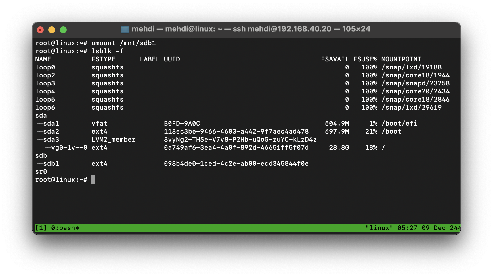

# DevOps Exercises

---

## **Session 1: Introduction to Linux and File Systems**

### **Student Name:** Mehdi Daneshvar

### **Date:** August 08, 2024

---

**1. [What is the MINIX file system?](#1-what-is-the-minix-file-system)**  
**2. [Which file systems are suitable for cache servers in response to HTTP requests?](#2-which-file-systems-are-suitable-for-cache-servers-in-response-to-http-requests)**  
**3. [What files are typically found in the LOST+FOUND directory?](#3-what-files-are-typically-found-in-the-lostfound-directory)**  
**4. [What is UMASK?](#4-what-is-umask)**  
**5. [Decrease “/“ dir with lvm](#5-decrease--dir-with-lvm)**  
**6. [How can a basic partition be converted to LVM?](#6-how-can-a-basic-partition-be-converted-to-lvm)**  

## 1. What is the MINIX file system?

### MINIX File System: Detailed Explanation

The **MINIX File System** was one of the earliest file systems designed for the MINIX operating system by **Andrew S. Tanenbaum**. MINIX is a simple operating system created for teaching purposes, and its file system was specifically designed to complement this educational goal.  

#### Features and Details of the MINIX File System

1. **Simple and Understandable Structure**:  
   This file system was built with simplicity in mind, making it easier for students and programmers to grasp its concepts without complexity.  

2. **Use of Inodes**:  
   Like many other file systems, MINIX relies on inodes to manage files and directories.  
   - Each inode stores information such as file size, block locations on the disk, and access permissions.

3. **File and Disk Size Limitations**:  
   - Due to its straightforward and early design, the MINIX file system had strict limitations on disk and file sizes.  
   - In early versions, the maximum disk size was 64 MB.

4. **Support for Small and Lightweight Files**:  
   While unsuitable for modern use cases, the MINIX file system is optimized for managing small files, making it a good choice for teaching and research.

5. **Primary Uses**:  
   - Primarily employed for educational and research purposes.  
   - Its transparency and well-documented design make it an excellent starting point for learning about file system and operating system design.

6. **Historical Significance**:  
   - MINIX influenced many other systems, including Linux. Linus Torvalds initially used MINIX as the basis for his studies before creating Linux.

#### Comparison with Modern File Systems

- The MINIX file system is far simpler than advanced file systems like **EXT4** or **NTFS**.  
- It lacks advanced features such as journaling, snapshots, or support for large files.  

## 2. Which file systems are suitable for cache servers in response to HTTP requests?

### **Suitable File Systems for Cache Servers Handling HTTP Requests**  

Cache servers play a critical role in enhancing the speed and efficiency of HTTP requests by storing frequently accessed data locally. The choice of a file system for such servers can significantly impact their performance, particularly in terms of read/write speed, data integrity, and management of large numbers of small files.

#### **Characteristics of an Ideal File System for Cache Servers**  

To support HTTP caching, the file system must provide:  

1. **High IOPS (Input/Output Operations Per Second):** Fast read/write operations are essential to serve cached files quickly.
2. **Efficient Handling of Small Files:** HTTP caches often store many small files such as HTML, CSS, and JavaScript.  
3. **Robustness:** The file system should recover gracefully after crashes or sudden power loss.  
4. **Scalability:** Ability to handle increasing storage demands without significant performance degradation.  
5. **Metadata Optimization:** Efficient metadata management for rapid file access and directory traversal.  

---

#### **Recommended File Systems**  

1. **EXT4 (Fourth Extended File System):**  
   - **Advantages:**  
     - Widely used and stable.  
     - Provides journaling for crash recovery.  
     - Supports delayed allocation, improving performance for sequential writes.  
   - **Usage Scenario:** General-purpose caching with moderate read/write loads.  

2. **XFS:**  
   - **Advantages:**  
     - Excellent for handling large files and high-throughput applications.  
     - Scalable for systems with high concurrent access.  
   - **Usage Scenario:** Cache servers with large objects or high concurrent HTTP requests.  

3. **Btrfs (B-tree File System):**  
   - **Advantages:**  
     - Advanced features like snapshots and compression.  
     - Integrated data integrity checks.  
   - **Usage Scenario:** Servers needing advanced data management or operating in environments prone to crashes.  

4. **ZFS (Zettabyte File System):**  
   - **Advantages:**  
     - Built-in data compression and error correction.  
     - Scales well for large storage systems.  
   - **Usage Scenario:** High-performance environments requiring robust data protection.  

5. **ReiserFS:**  
   - **Advantages:**  
     - Optimized for small file handling and fast directory operations.  
   - **Usage Scenario:** Systems with high numbers of small files (e.g., web caches).  

6. **tmpfs (Temporary File System):**  
   - **Advantages:**  
     - Stores files directly in RAM, offering ultra-fast read/write speeds.  
   - **Usage Scenario:** Temporary or short-lived cache data where persistence is not required.  

---

#### **Key Considerations for Selection**  

- **Workload Type:** Understand whether your cache server will handle more small files, large files, or a mix.  
- **Hardware Resources:** High-performance file systems like ZFS or tmpfs may require more RAM and CPU.  
- **Data Persistence:** For temporary cache, tmpfs is ideal. For persistent cache, EXT4 or XFS is better suited.  
- **Cost and Maintenance:** Some file systems (e.g., ZFS) require more expertise to maintain.  

---

## 3. What files are typically found in the LOST+FOUND directory?

The **LOST+FOUND** directory is a special directory present in file systems like **EXT2**, **EXT3**, and **EXT4**. It serves as a recovery area for files that the system cannot fully associate with their original directory structures during a file system check (fsck). When file system inconsistencies are detected, such as after an unexpected crash or power failure, fsck attempts to repair the damage. If it finds orphaned files or file fragments (files without a parent directory or proper metadata), it relocates them to the LOST+FOUND directory to prevent data loss.

The files in LOST+FOUND typically include incomplete, fragmented, or unlinked data that the system cannot automatically restore to their original location. These files are often renamed with numeric identifiers corresponding to their inode numbers. Administrators can inspect these files to determine their content and, if necessary, manually relocate or delete them. While LOST+FOUND plays a crucial role in data recovery, its presence underscores the importance of regular backups to safeguard critical information.

## 4. What is UMASK?

**UMASK (User Mask)** is a default permission setting in Unix-like operating systems that determines the permissions for newly created files and directories. It works by subtracting its value from the system’s default permissions (usually 666 for files and 777 for directories). For example, a UMASK value of `022` means that write permissions will be removed for group and others, resulting in files with `644` permissions and directories with `755` permissions. UMASK ensures that files and directories are created with restricted access by default, enhancing system security. Users can adjust UMASK based on their security requirements.

## 5. Decrease “/“ dir with lvm

To decrease the size of the root (`/`) directory managed by Logical Volume Manager (LVM), you need to follow careful steps, as this process involves the risk of data loss. Always ensure a full backup of your data before proceeding. Here's a summarized process:  

---

### **Steps to Decrease `/` Directory with LVM**

1. **Backup the Data:**  
   Since resizing involves altering partitions, any error can lead to data loss. Use tools like `rsync` or `tar` to back up critical files.
2. **Check the Current Size:**  
   First, check the current size of the filesystem:

   ```bash
   df -h /
   ```

   

3. **Boot into Rescue Mode:**  
   You cannot resize the root filesystem while it is in use. Boot the system using a live CD/USB or recovery mode.  

4. **Check Filesystem Integrity:**  
   Verify that the filesystem is intact:

   ```bash
   e2fsck -f /dev/volume_group/logical_volume
   ```

   

5. **Reduce the Filesystem Size:**  

   Use a tool like `resize2fs` for EXT filesystems to shrink it:

     ```bash
     resize2fs /dev/volume_group/logical_volume new_size
     ```

     Replace `new_size` with the desired size, e.g., `10G` for 10GB.

     

6. **Reduce the Logical Volume Size:**  
   After resizing the filesystem, reduce the logical volume size:

   ```bash
   lvreduce -L new_size /dev/volume_group/logical_volume
   ```

   

7. **Recheck Filesystem Integrity:**  
   Verify that the filesystem is intact:

   ```bash
   e2fsck -f /dev/volume_group/logical_volume
   ```

   

8. **Reboot the System to Normal Mode:**  
   After completing the resizing process, restart the system from rescue mode and boot it into normal operating mode.

9. **Verify the Filesystem Size:**  
   Confirm the new size of the root filesystem:

   ```bash
   df -h /
   ```

   

---

### **Key Notes:**  

- Resizing the root partition is risky and not typically recommended unless absolutely necessary.  
- If possible, test these steps in a virtualized environment before attempting them on a production system.  
- For non-EXT filesystems, the resizing commands might differ (e.g., `xfs_growfs` does not support shrinking).

## 6. How can a basic partition be converted to LVM?

### How to Convert a Basic Partition to LVM  

Converting a basic partition to LVM (Logical Volume Manager) requires careful steps, as it involves data migration and potential downtime. Direct conversion without data loss is not possible, so the process typically includes creating a new LVM structure and transferring data. Here's how to do it:  

1. **Backup Your Data:**  
   Since the process involves data manipulation, ensure you back up all important files from the partition.
   

2. **Identify and Unmount the Partition::**  
   Use the lsblk or fdisk -l command to locate the basic partition you wish to convert.
   
   Unmount the partition:

   ```bash
   umount /mnt/sdb1
   ```

   

3. **Create a New Physical Volume (PV):**  
  Convert the target partition into an LVM physical volume:

   ```bash
   pvcreate /dev/sdX
   ```

   

   Replace `/dev/sdX` with the partition name.

4. **Create a Volume Group (VG):**  
   Add the physical volume to a new or existing volume group:

   ```bash
   vgcreate my_vg /dev/sdX
   ```

   

5. **Create Logical Volumes (LV):**  
   Create one or more logical volumes within the volume group:

   ```bash
   lvcreate -L size -n lv_name my_vg
   ```

   

6. **Format the Logical Volume:**  
   Format the logical volume with the desired file system (e.g., EXT4):

   ```bash
   mkfs.ext4 /dev/my_vg/lv_name
   ```

   

7. **Migrate Data:**  
   Mount the logical volume and copy the data from the original partition:

   ```bash
   mount /dev/my_vg/lv_name /mnt
   rsync -av /source_partition /mnt
   ```

   

8. **Update `/etc/fstab`:**  
   Update the `/etc/fstab` file to reflect the new logical volume for automatic mounting:

   ```bash
   /dev/my_vg/lv_name /mount_point ext4 defaults 0 0
   ```

   

9. **Verify and Cleanup:**  
   Unmount the old partition, remove it from the system if necessary, and reboot to ensure the changes are applied.  

By following these steps, you can effectively convert a basic partition into an LVM-managed structure while maintaining your data.
