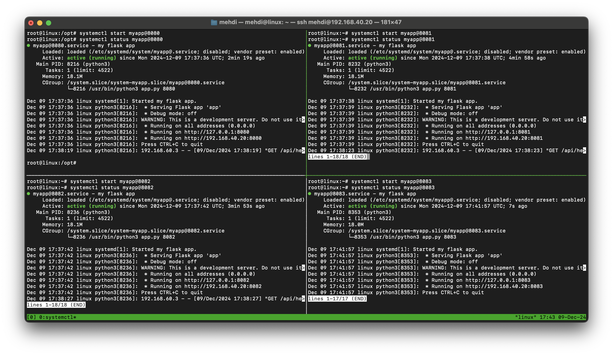
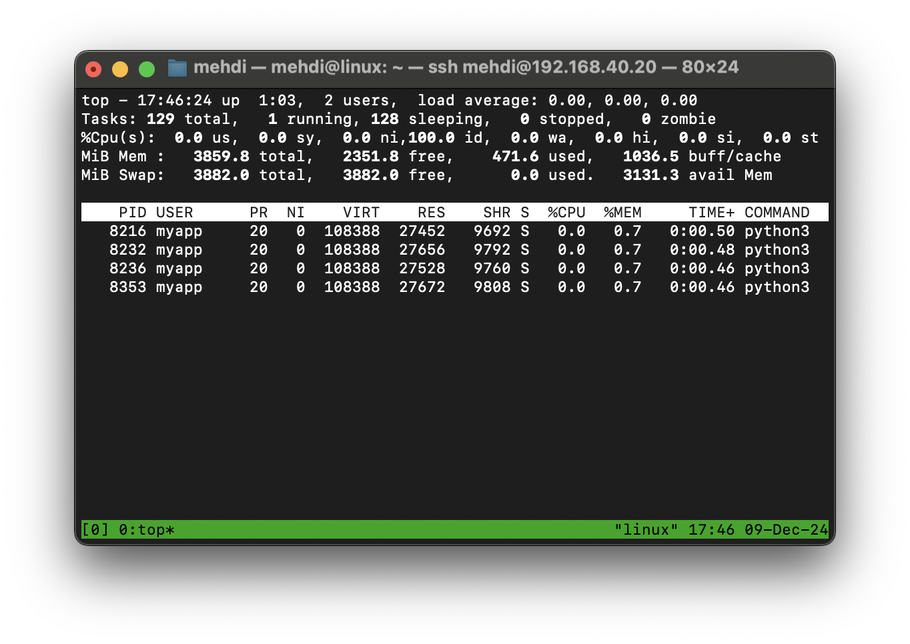
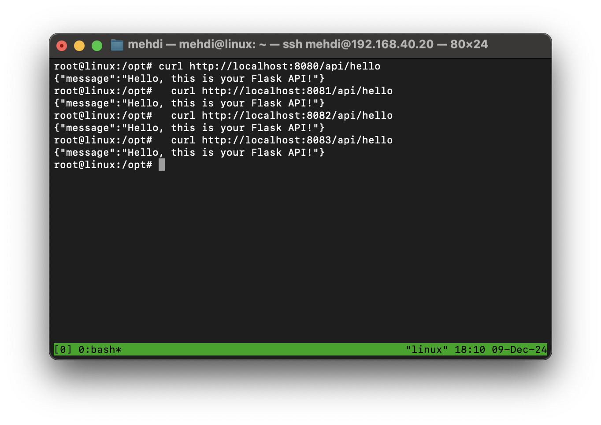

# DevOps Exercises

---

## **Session 2: Managing Flask Applications with systemd**

### **Student Name:** Mehdi Daneshvar

### **Date:** August 15, 2024

---

## Running Multiple Instances of a Flask Application with systemd

### **`/opt/myapp/app.py`**

```python
from flask import Flask, jsonify
import sys
app=Flask(__name__)
@app.route('/api/hello')
def hello():
    response={'message': 'Hello, this is your Flask API!'}
    return jsonify(response)
if __name__ == '__main__':
    port=int(sys.argv[1] if len(sys.argv)>1 else 5000)
    app.run(host='0.0.0.0',port=port)
```

This file defines a basic Flask application that listens on a specified port and responds with a JSON message.

---

### **`/etc/systemd/system/myapp@.service`**

```ini
[Unit]
Description=my flask app
After=network.target

[Service]
Restart=always
User=myapp
Group=myapp
WorkingDirectory=/opt/myapp
ExecStart=/usr/bin/python3 app.py %i

[Install]
WantedBy=default.target
```

This systemd unit file allows running multiple instances of the Flask application. `%i` in `ExecStart` is a placeholder for the instance identifier, typically used to pass the port number.  

---

### **Steps to Run Multiple Instances**

1. **Create the `myapp` User**  
   Ensure the `myapp` user exists to run the service securely:  

   ```bash
   sudo useradd -r -s /bin/false myapp
   ```

2. **Start Services**  
   Run multiple instances of the application by specifying different ports:  

   ```bash
   systemctl start myapp@8080
   systemctl start myapp@8081
   systemctl start myapp@8082
   systemctl start myapp@8083
   ```

3. **Enable Services at Boot**  
   Ensure the services start automatically after a reboot:  

   ```bash
   systemctl enable myapp@8080
   systemctl enable myapp@8081
   systemctl enable myapp@8082
   systemctl enable myapp@8083
   ```

4. **Check Service Status**  
   Verify that the services are running properly:  

   ```bash
   systemctl status myapp@8080
   systemctl status myapp@8081
   systemctl status myapp@8082
   systemctl status myapp@8083
   ```

   Example output:  
   

---

### **Verify Running Services**

- Use `top` to check running processes under the `myapp` user:  

   ```bash
   top -u myapp
   ```

   Example output:  
   

- Test the API for each instance:

  ```bash
  curl http://localhost:8080/api/hello
  curl http://localhost:8081/api/hello
  curl http://localhost:8082/api/hello
  curl http://localhost:8083/api/hello
  ```

Example output:  


---
