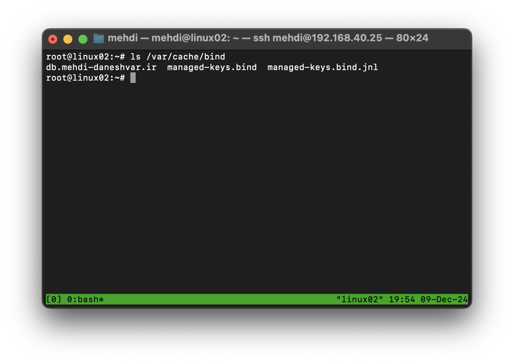
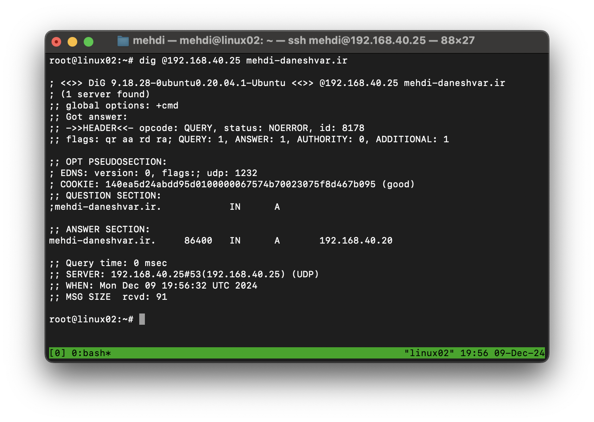

# DevOps Exercises

---

## **Session 3: Web Servers, DNSSEC, and Configuring Slave DNS**

### **Student Name:** Mehdi Daneshvar

### **Date:** August 29, 2024

---

**1. [What are the differences between the Nginx and Apache web servers?](#1--what-are-the-differences-between-the-nginx-and-apache-web-servers)**  
**2. [What is DNSSEC?](#2--what-is-dnssec)**  
**3. [Setup Slave DNS Server](#3--setup-slave-dns-server)**  

### **1- What are the differences between the Nginx and Apache web servers?**

Nginx and Apache are two popular open-source web servers, but they differ significantly in their design and use cases:  

- **Architecture:**  
  - **Apache:** Uses a process-driven model, where each request is handled by a separate thread or process. This can lead to higher memory usage, especially under heavy traffic.  
  - **Nginx:** Employs an event-driven and asynchronous architecture, allowing it to handle multiple connections efficiently with low resource consumption.  

- **Performance:**  
  - **Apache:** Performs well for dynamic content with its modules like mod_php. However, it may struggle with static content under heavy loads.  
  - **Nginx:** Excels at serving static content quickly due to its event-driven nature and optimized resource usage.  

- **Configuration:**  
  - **Apache:** Offers flexibility with per-directory configurations using `.htaccess` files, suitable for shared hosting.  
  - **Nginx:** Relies on a central configuration file, which can be less flexible but results in faster performance.  

- **Use Cases:**  
  - Apache is often chosen for setups requiring dynamic content handling or complex configurations.  
  - Nginx is preferred for high-performance scenarios, reverse proxying, or handling large numbers of concurrent connections.  

### **2- What is DNSSEC?**

DNSSEC (Domain Name System Security Extensions) is a suite of protocols that enhances the security of the DNS by adding cryptographic signatures to DNS records.  

- **Purpose:** It protects users from DNS spoofing or man-in-the-middle attacks by ensuring that the responses to DNS queries are authentic and have not been tampered with.  
- **How It Works:**  
  - DNSSEC uses public key cryptography to sign DNS data.  
  - Each DNS zone has a pair of keys: a private key to sign records and a public key to verify them.  
  - When a DNS query is made, the resolver can verify the digital signature to ensure data integrity.  
- **Limitations:**  
  - It does not encrypt DNS queries, so data privacy is not guaranteed.  

### **3- Setup Slave DNS Server**

This guide explains how to set up a **Master** and **Slave** DNS server with the domain `mehdi-daneshvar.ir`.  

---

#### **Step 1: Install BIND on the Master Server**  

1. Install BIND on the master server:  

   ```bash
   sudo apt install bind9
   ```  

2. Configure the Zone for `mehdi-daneshvar.ir`:  
   Add the following zone definition in the master server's configuration file (e.g., `/etc/bind/named.conf.local`):  

   ```bash
   zone "mehdi-daneshvar.ir" {
       type master;
       file "/etc/bind/db.mehdi-daneshvar.ir";
       allow-transfer { 192.168.40.25; }; # Slave DNS server IP
   };
   ```  

3. Create the Zone File:  
   Use the template below to create `/etc/bind/db.mehdi-daneshvar.ir`:  

   ```bash
   $TTL    86400
   @       IN      SOA     ns1.mehdi-daneshvar.ir. admin.mehdi-daneshvar.ir. (
                        2024120901 ; Serial
                        3600       ; Refresh = 1h
                        1800       ; Retry = 30m
                        1209600    ; Expire = 14d
                        86400 )    ; Minimum TTL = 24h
    ; Name Servers
    @       IN      NS      ns1.mehdi-daneshvar.ir.
    @       IN      NS      ns2.mehdi-daneshvar.ir.

    ; A Records
    ns1     IN      A       192.168.40.26
    ns2     IN      A       192.168.40.25
    @       IN      A       192.168.40.20
   ```

4. Restart the BIND Service on the Master Server:  

   ```bash
   sudo systemctl restart bind9
   ```  

---

#### **Step 2: Install BIND on the Slave Server**  

1. Install BIND on the slave server:  

   ```bash
   sudo apt install bind9
   ```  

2. Configure the Slave Zone:  
   Add a slave zone in the configuration file of the slave server (e.g., `/etc/bind/named.conf.local`):  

   ```bash
   zone "mehdi-daneshvar.ir" {
       type slave;
       file "/var/cache/bind/db.mehdi-daneshvar.ir";
       masters { 192.168.40.26; }; # Master DNS server IP
   };
   ```  

3. Restart the BIND Service on the Slave Server:  

   ```bash
   sudo systemctl restart bind9
   ```  

---

#### **Step 3: Test the Setup**  

1. On the **Slave Server**, verify that it has received the zone data from the master:  

   ```bash
   ls /var/cache/bind/
   ```  

   

2. Use `dig` to query the domain from the **Slave Server**:  

   ```bash
   dig @192.168.40.25 mehdi-daneshvar.ir
   ```  

   

---

### **Notes**  

- Make sure that the `allow-transfer` option in the master server allows the slave's IP address.  
- Ensure firewall rules allow DNS traffic (port 53) between the master and slave servers.  
- Always use appropriate serial numbers in the zone file for updates to propagate correctly.  
