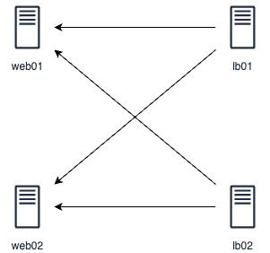

# DevOps Exercises

---

## **Session 4: High-Availability Load Balancing with HAProxy and Keepalived in Active-Active Mode**

### **Student Name:** Mehdi Daneshvar

### **Date:** September 5, 2024

---

**[Step 1: Perform SSL termination using HAProxy, ensuring that traffic from the client to HAProxy is HTTPS, and from HAProxy onwards is HTTP.](#step-1-ssl-termination-with-haproxy-on-lb01)**  
**[Step 2: Configure HAProxy with Keepalived for high availability.](#step-2-configure-haproxy-with-keepalived-for-high-availability)**  
**[Final Step: Configure Keepalived in an active-active mode.](#final-step-configure-keepalived-in-active-active-mode)**



**IP addreess:**

|         server        |         IP        |
|:--------------------:|:--------------------:|
| web01 | 192.168.40.26 |
| web02 | 192.168.40.25 |
| lb01 | 192.168.40.29 |
| lb02| 192.168.40.28 |
| keepalived | 192.168.40.50 |
| keepalived (avtive-active)| 192.168.40.51,192.168.40.52 |
|||

### **Step 1: SSL Termination with HAProxy on `lb01`**

#### **Setup HAProxy on `lb01`:**

1. **Install HAProxy:**

   ```bash
   apt update && apt install haproxy -y
   ```

2. **Generate SSL Certificates (Self-Signed or Obtain via Let's Encrypt):**

   ```bash
   mkdir -p /etc/ssl/private
   openssl req -new -newkey rsa:2048 -days 365 -nodes -x509 \
       -keyout /etc/ssl/private/haproxy.key \
       -out /etc/ssl/private/haproxy.crt
   cat /etc/ssl/private/haproxy.crt /etc/ssl/private/haproxy.key > /etc/ssl/private/haproxy.pem
   chmod 600 /etc/ssl/private/haproxy.pem
   ```

3. **Edit HAProxy Configuration:**

   Open `/etc/haproxy/haproxy.cfg` and configure as follows:

   ```ini
   global
       log /dev/log local0
       log /dev/log local1 notice
       chroot /var/lib/haproxy
       stats socket /run/haproxy/admin.sock mode 660 level admin
       stats timeout 30s
       user haproxy
       group haproxy
       daemon

   defaults
       log     global
       option  httplog
       option  dontlognull
       timeout connect 5000ms
       timeout client  50000ms
       timeout server  50000ms

   frontend https-in
       bind *:443 ssl crt /etc/ssl/private/haproxy.pem
       default_backend web_servers

   backend web_servers
       balance roundrobin
       option httpchk HEAD / HTTP/1.1\r\nHost:localhost
       server web01 192.168.40.26:80 check
       server web02 192.168.40.25:80 check
   ```

4. **Restart HAProxy:**

   ```bash
   systemctl restart haproxy
   ```

5. **Test SSL Termination:**

   Open your browser and navigate to `https://<lb01-IP>`. Traffic will terminate SSL at `lb01` and forward to `web01` or `web02` using HTTP.

|         web01        |         web02        |
|:--------------------:|:--------------------:|
|  |  |

---

### **Step 2: Configure HAProxy with Keepalived for High Availability**

#### **Setup Keepalived on `lb01`:**

1. **Install Keepalived:**

   ```bash
   apt install keepalived -y
   ```

2. **Edit Keepalived Configuration:**

   Open `/etc/keepalived/keepalived.conf` and configure as follows for `lb01`:

   ```ini
   global_defs {
       router_id haproxy_ha
   }

   vrrp_script chk_haproxy {
       script "killall -0 haproxy"
   }

   vrrp_instance VI_1 {
       state MASTER
       interface eth0
       virtual_router_id 51
       priority 100
       advert_int 1

       authentication {
           auth_type PASS
           auth_pass my_secret
       }

       virtual_ipaddress {
           192.168.40.50
       }

       track_script {
           chk_haproxy
       }
   }
   ```

3. **Start and Enable Keepalived:**

   ```bash
   systemctl start keepalived
   systemctl enable keepalived
   ```

#### **Setup HAProxy and Keepalived on `lb02`:**

Repeat the above steps for HAProxy installation on `lb02`, but modify `keepalived.conf` as follows:

   ```ini
   global_defs {
       router_id haproxy_ha
   }

   vrrp_script chk_haproxy {
       script "killall -0 haproxy"
   }

   vrrp_instance VI_1 {
       state BACKUP
       interface eth0
       virtual_router_id 51
       priority 90
       advert_int 1

       authentication {
           auth_type PASS
           auth_pass my_secret
       }

       virtual_ipaddress {
           192.168.40.50
       }

       track_script {
           chk_haproxy
       }
   }
   ```

#### **Test High Availability:**

- Access the virtual IP `192.168.40.50`.  
- Stop Keepalived on `lb01` to ensure `lb02` takes over as MASTER.

|         web01        |         web02        |
|:--------------------:|:--------------------:|
|  |  |

---

### **Final Step: Configure Keepalived in Active-Active Mode**

#### **Active-Active Configuration:**

1. Modify both `lb01` and `lb02` configurations to include multiple virtual IP addresses and use appropriate priorities for traffic distribution.

   On `lb01`:

   ```ini
   global_defs {
       router_id haproxy_ha
   }

   vrrp_script chk_haproxy {
       script "killall -0 haproxy"
   }

   vrrp_instance VI_1 {
       state MASTER
       interface eth0
       virtual_router_id 51
       priority 100
       advert_int 1

       authentication {
           auth_type PASS
           auth_pass my_secret
       }

       virtual_ipaddress {
           192.168.40.51
       }

       track_script {
           chk_haproxy
       }
   }

   vrrp_instance VI_2 {
       state BACKUP
       interface eth0
       virtual_router_id 61
       priority 90
       advert_int 1

       authentication {
           auth_type PASS
           auth_pass my_secret
       }

       virtual_ipaddress {
           192.168.40.52
       }

       track_script {
           chk_haproxy
       }
   }
   ```

   On `lb02`:

   ```ini
   global_defs {
       router_id haproxy_ha
   }

   vrrp_script chk_haproxy {
       script "killall -0 haproxy"
   }

   vrrp_instance VI_1 {
       state BACKUP
       interface eth0
       virtual_router_id 51
       priority 90
       advert_int 1

       authentication {
           auth_type PASS
           auth_pass my_secret
       }

       virtual_ipaddress {
           192.168.40.51
       }

       track_script {
           chk_haproxy
       }
   }

   vrrp_instance VI_2 {
       state MASTER
       interface eth0
       virtual_router_id 61
       priority 100
       advert_int 1

       authentication {
           auth_type PASS
           auth_pass my_secret
       }

       virtual_ipaddress {
           192.168.40.52
       }

       track_script {
           chk_haproxy
       }
   }
   ```

2. Restart `Keepalived` on both servers:

   ```bash
   systemctl restart keepalived
   ```

#### **Validate Active-Active Setup:**

- Check the virtual IPs are active and functioning on both servers.
- Test load balancing by simulating traffic to each virtual IP.

|         web01        |         web02        |
|:--------------------:|:--------------------:|
|  |  |
|  |  |
