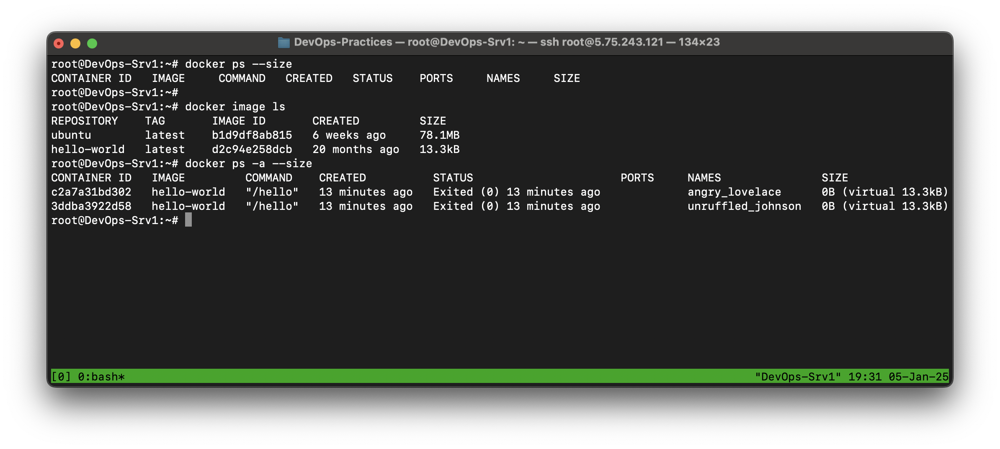
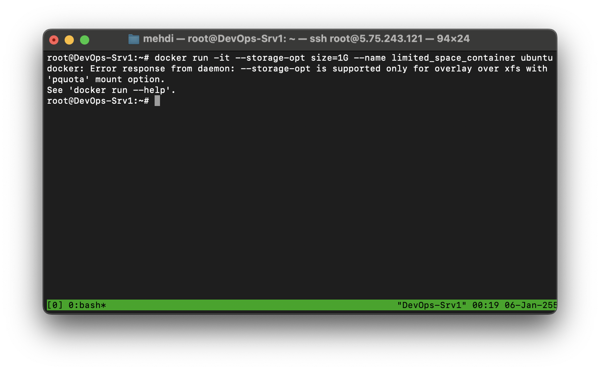
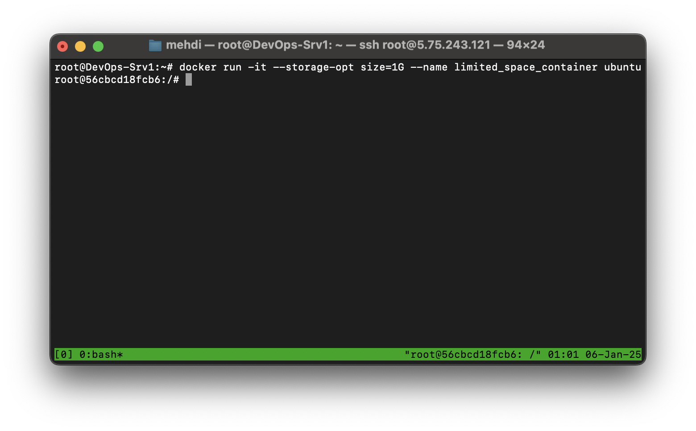
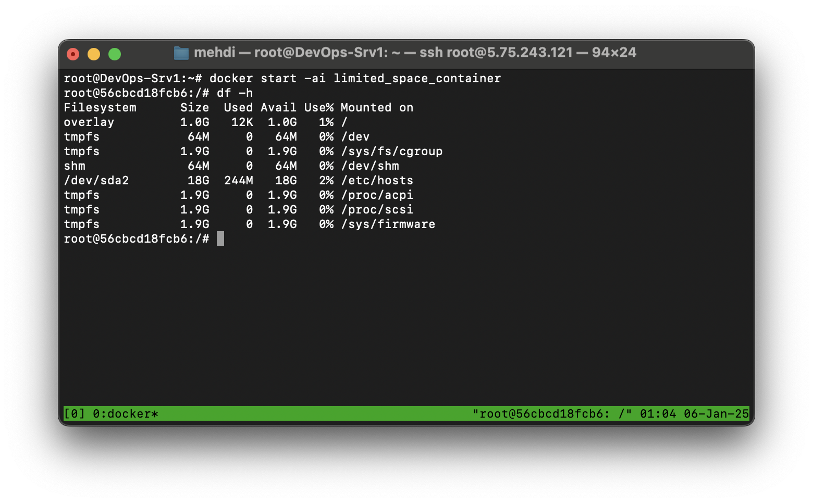
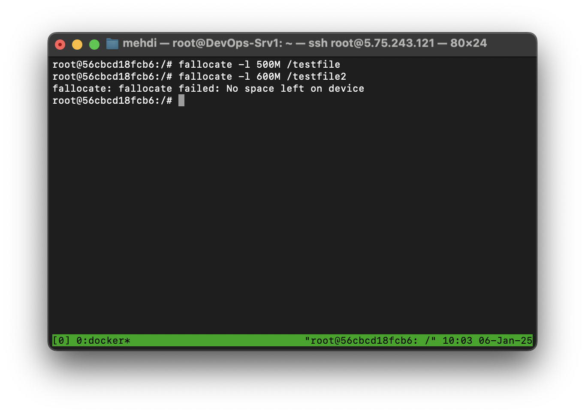
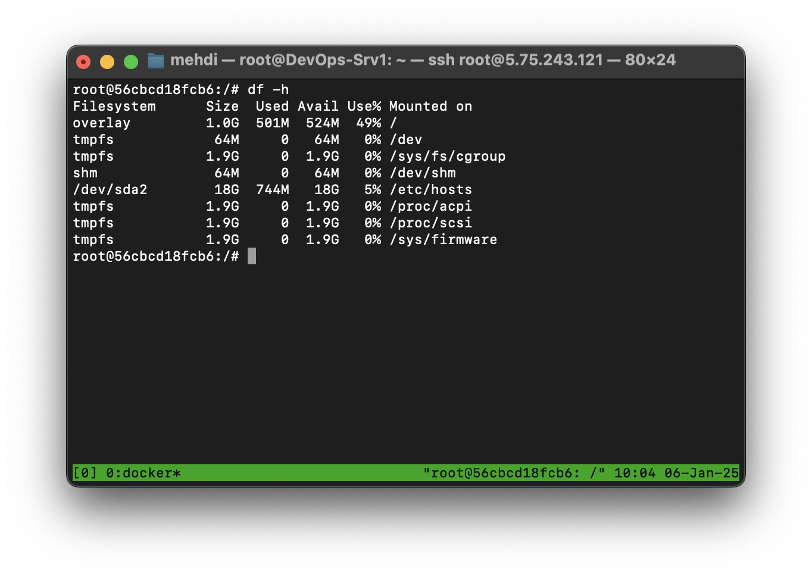

# DevOps Exercises

---

## **Session 6: Understanding Docker Disk Management**

### **Student Name:** Mehdi Daneshvar

### **Date:** September 26, 2024

---

**1. [Difference Between "Size" and "Virtual Size" in Docker and Virtual Machines](#1-difference-between-size-and-virtual-size-in-docker-and-virtual-machines)**  
**2.[Create a Docker Container with Limited Disk Space](#2-create-a-docker-container-with-limited-disk-space)**

### **1. Difference Between "Size" and "Virtual Size" in Docker and Virtual Machines:**  

#### **Docker:**  

- **Size:**  
  Refers to the amount of disk space consumed by the writable layer of the container. This includes changes made after the container was started (like added files or installed packages).  

- **Virtual Size:**  
  Represents the total size of the container, which is the sum of the base image size and the writable layer. It provides a broader view of the container's disk usage.  



#### **Virtual Machines (VMs):**  

- **Size:**  
  Indicates the actual disk space being used by the virtual machine's data and operating system.  

- **Virtual Size:**  
  Refers to the maximum allocated disk space for the virtual machine, regardless of how much is currently in use.  

---

### **2. Create a Docker Container with Limited Disk Space:**  

This exercise demonstrates how to create a Docker container with limited disk space and handle the "filesystem does not support" error when setting storage options.

#### **Step 1: Attempt to Create a Container with Limited Disk Space**

Run the following command to create a container with limited disk space:

```bash
docker run -it --storage-opt size=1G --name limited_space_container ubuntu
```

You may encounter the following error:

```plaintext
docker: Error response from daemon: --storage-opt is supported only for overlay over xfs with 'pquota' mount option.
```



This error occurs because the underlying filesystem does not support the required `pquota` mount option for disk space quotas.

#### **Step 2: Prepare the /dev/sda2 Partition**

Assume we have an unused partition at `/dev/sda2`. We will configure this partition with the XFS filesystem and enable the `pquota` option.

1. **Format the Partition with XFS**:

   ```bash
   mkfs.xfs -f /dev/sda2
   ```

2. **Backup Existing Docker Data**:

   Stop the Docker service and back up the existing data:

   ```bash
   systemctl stop docker.socket
   systemctl stop docker.service
   tar -czvf /tmp/docker_backup.tar.gz /var/lib/docker
   ```

3. **Remove Previous Data**:

   Since we do not need the previous data in `/var/lib/docker`, the directory can be cleared to prepare for the new partition.

   ```bash
   rm -rf /var/lib/docker/*
   ```

4. **Mount the Disk with 'pquota'**:

   Edit the /etc/fstab file and add the following line:

   ```bash
   /dev/sda2 /var/lib/docker xfs defaults,pquota 0 0
   ```

   Apply the changes:

   ```bash
   mount -a
   ```

#### **Step 3: Restore Docker Data**

1. **Restore Data to the New Partition**:

   Extract the backed-up data into the new partition:

   ```bash
   tar -xzvf /tmp/docker_backup.tar.gz -C /
   ```

2. **Restart Docker Service**:

   ```bash
   systemctl start docker
   ```

#### **Step 4: Create the Container Again**

Run the command to create the container with limited disk space:

```bash
docker run -it --storage-opt size=1G --name limited_space_container ubuntu
```

This time, the container should be created successfully.



#### **Step 5: Verify Disk Space Inside the Container**

1. Start the container:

   ```bash
   docker start -ai limited_space_container
   ```

2. Check the available disk space:

   ```bash
   df -h
   ```

   Output:

   ```plaintext
   Filesystem      Size  Used Avail Use% Mounted on
   overlay         1.0G     0  1.0G   0% /
   ```

This confirms that the container is limited to 1GB of disk space.



#### **Step 6: Test Disk Usage in the Container**

To validate the quota, create a test file in the container:

```bash
fallocate -l 500M /testfile
fallocate -l 600M /testfile2
```

The second command should fail due to exceeding the 1GB limit. Use df -h again to verify the space usage. This step confirms that the quota is enforced correctly.

|  |  |
|-:|-:|
